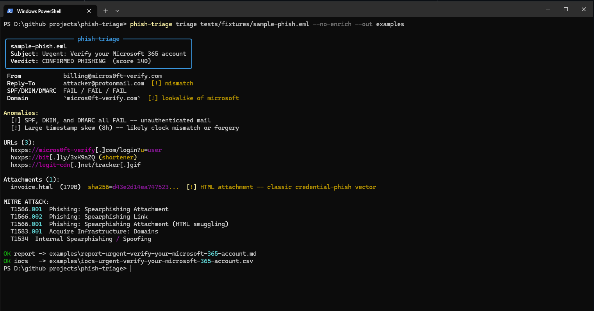

# phish-triage

> Turn a `.eml` file into a complete phishing incident report in 30 seconds.

`phish-triage` is the SOC-analyst tool that does in one command what currently takes 15 minutes of tab-hopping: parse the email, analyze headers, extract URLs, hash attachments, detect lookalike sender domains, optionally enrich against VirusTotal / URLscan / AbuseIPDB, map to MITRE ATT&CK, score a verdict, and emit a ticket-ready markdown report plus an IOC CSV for SIEM ingestion.

Works fully offline. API enrichment is opt-in — set whichever keys you have.



---

## Why

Every SOC handles user-reported phishing the same way:

1. User clicks "Report Phishing" → `.eml` lands in a shared mailbox
2. Analyst opens it, copies the headers into Mxtoolbox, opens 6 tabs to look up the URLs and attachments, copies SHA256s into VirusTotal, checks the sender domain's age in whois, finally writes a Jira ticket with all of the above

That's 10–20 minutes per email, and most of it is mechanical. SOAR platforms automate it but cost $50k+/year. This is the same workflow as one binary.

```
$ phish-triage suspicious.eml
```

## Quickstart (zero setup)

Requires Python 3.9+. Three commands and you have a triage report:

```bash
git clone https://github.com/pashasec/phish-triage.git
cd phish-triage
./run.sh tests/fixtures/sample-phish.eml --no-enrich
```

That's it. `run.sh` creates a virtualenv on first call, installs deps, runs the tool, and is idempotent — subsequent calls just run.

Windows users:

```cmd
git clone https://github.com/pashasec/phish-triage.git
cd phish-triage
run.bat tests\fixtures\sample-phish.eml --no-enrich
```

The script writes `report-<subject>.md` and `iocs-<subject>.csv` to the current directory, prints a terminal summary, and exits with code `2` when the verdict is `likely-phishing` or `confirmed-phishing` (useful for piping into mail-gateway hooks).

### Install as a command (optional)

If you want `phish-triage` on your `PATH` instead of running via `./run.sh`:

```bash
# Recommended: pipx (managed venv, command available everywhere)
pipx install -e .

# Or: classic virtualenv
python3 -m venv .venv && source .venv/bin/activate
pip install -e .
phish-triage tests/fixtures/sample-phish.eml
```

> PyPI release is planned; for now install from source.

### Optional enrichment

Copy `.env.example` to `.env` and fill in whichever keys you have:

```ini
VIRUSTOTAL_API_KEY=...
URLSCAN_API_KEY=...
ABUSEIPDB_API_KEY=...
```

`phish-triage` reads them from the environment — load with `set -a; . .env; set +a` or your preferred env loader. Missing keys silently skip the corresponding source.

## What it checks

| Signal | Source |
|---|---|
| SPF / DKIM / DMARC verdict | `Authentication-Results` header |
| Received hop chain (origin IP, ASN, geolocation, timestamps) | `Received:` headers |
| Timestamp skew & header-forgery anomalies | hop-pair deltas |
| Reply-To mismatch | `From` vs `Reply-To` |
| Sender domain age | python-whois |
| Lookalike domain (Microsoft / Google / Amazon / 30+ brands) | edit distance + homoglyph normalization |
| URL extraction from plaintext + HTML | regex + BeautifulSoup |
| URL defanging (`hxxps://example[.]com`) | SOC convention |
| Shortener expansion (bit.ly, t.co, tinyurl, …) | HEAD request |
| Attachment SHA256 / SHA1 / MD5 | hashlib |
| Dangerous filetypes (`.exe`, `.scr`, `.js`, `.hta`, …) | extension allowlist |
| Macro-enabled docs (`.docm`, `.xlsm`, …) | extension allowlist |
| HTML attachments (credential-harvest vector) | extension allowlist |
| Double-extension trick (`invoice.pdf.exe`) | extension parser |
| External reputation (VirusTotal, URLscan, AbuseIPDB) | opt-in via API key |
| MITRE ATT&CK technique mapping | rule-based |
| Verdict scoring (`clean` / `suspicious` / `likely` / `confirmed`) | additive heuristic |

## Output

The markdown report has all of:

- **Verdict** with confidence score and contributing signals
- **Sender** block (From, Reply-To, Return-Path, Date, Message-ID)
- **Sender domain** (registered date, registrar, lookalike flags)
- **Authentication** (SPF/DKIM/DMARC)
- **Hop analysis** with timestamps + anomaly flags
- **URLs** (defanged, expanded, with per-source reputation)
- **Attachments** with all hashes + risk flags + reputation
- **MITRE ATT&CK** techniques observed
- **Verdict detail** breaking down every score contribution

The IOC CSV is one row per indicator (`type, value, context, source_verdict`) — drop it into Splunk / Sentinel / TheHive / MISP without reformatting.

## CLI

```
Usage: phish-triage [OPTIONS] EML

  Triage a single .eml file end-to-end.

Arguments:
  EML  Path to .eml file  [required]

Options:
  -o, --out PATH               Directory for the report and IOC CSV  [default: .]
  --expand / --no-expand       Expand shortened URLs via HEAD  [default: expand]
  --enrich / --no-enrich       Run external API enrichment when keys are set  [default: enrich]
  -q, --quiet                  Suppress the terminal summary
  --version                    Show version and exit
```

Exit codes:
- `0` — verdict was `clean` or `suspicious`
- `2` — verdict was `likely-phishing` or `confirmed-phishing` (block / quarantine)

## Use it in a mail gateway

```bash
# Postfix content_filter, Sieve filter, etc.
phish-triage "$EML_FILE" --quiet --no-enrich --out /var/log/phish
if [ $? -eq 2 ]; then
    mv "$EML_FILE" /var/quarantine/
fi
```

## Tests

```bash
pip install -e ".[dev]"
pytest
```

## Roadmap

- [ ] Auto-screenshot URL landing pages via headless Chromium
- [ ] Hybrid Analysis & Joe Sandbox enrichment
- [ ] OpenCTI / MISP push for confirmed IOCs
- [ ] HTML-attachment static analysis (extract form actions, decode obfuscation)
- [ ] `--watch DIR` mode for shared-mailbox polling
- [ ] Bundled Docker image with all deps pre-installed

PRs welcome.

## License

MIT — see [LICENSE](LICENSE).

---

Part of the [30 tools in 30 days](https://github.com/pashasec) challenge.
